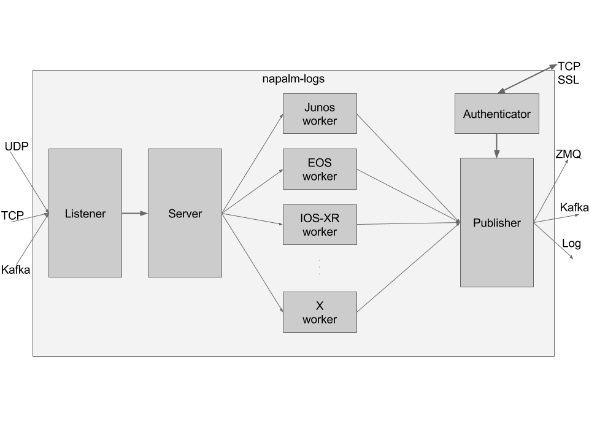

.. _architecture:

============
Architecture
============

Besides speed, there were a couple of considerations we had in mind when we
designed napalm-logs:

- Size
- Security
- Flexibility
- Reliability

The core achitecture can be represented in the diagram below; for simplicity,
we will analyse the security in the :ref:`Authenticator <arch-authenticator>`
paragraph:

.. image:: ../_static/architecture.png
   :height: 720px
   :width: 960px
   :scale: 75%
   :alt: napalm-logs architecture
   :align: center

The napalm-logs prgram starts a couple of processes to handle and manipulate the
syslog messages. We called them:

- :ref:`Listener <arch-listener>`
- :ref:`Server <arch-server>`
- :ref:`Device (one per platform) <arch-device>`
- :ref:`Publisher <arch-publisher>`

The processes communicate between them using
`ZeroMQ IPC <http://api.zeromq.org/2-1:zmq-ipc>`_.

.. _arch-listener:

Listener
++++++++

The Listener has the role to receive the syslog snippets and queue them
(``PUSH``) into an IPC socket to the Server. This has two advantages: we ensure
we queue the messages immediately as received - no time wasted triaging (this
is very important when the messages are received over UDP, for example -- see
the :ref:`listener-udp` listener). The other gain by doing so is that we don't
loose any messages: not even when the napalm-logs process crashes or is
intentionally stopped: after restart, the Server will continue dequeuing
messages from that buffer.

The Listener is a pluggable interface, check :ref:`listener` for more details.

The communication between the Listener and the Server is a straight PUSH-PULL
socket.

.. _arch-server:

Server
++++++

The Server is the process that deals with the triage: using the
:ref:`device-profiles`, it identifies the platform it comes from. Using this
information, the messages will be queued to the corresponding worker (see next
section). The pattern in this case is a
`Ventiallator Sink <http://zguide.zeromq.org/py:all#Divide-and-Conquer>`_,
more specifically implemented using
`ROUTER and DEALER <http://zeromq.org/tutorials:dealer-and-router>`_
sockets, where the Server is the ROUTER, and each Platform Worker is a DEALER.

The messages at this point are partially parsed, and they can be published
using one of the available :ref:`publisher`, through the :ref:`logger`
interface.
When unable to identify the platform, the message is by default discarded.
However, the user can activate the messages to be published using the
:ref:`publisher-opts-send-unknown` option, the format being :ref:`UNKNOWN`.
Note that the Logger interface has a similar option,
:ref:`logger-opts-send-unknown`.

.. _arch-device:

Device
++++++

There is one device worker started per platform. Each worker receives the
partially processed messages from the Server, then extracts the data and maps
it to the OpenConfig or IETF YANG model, as configured in the
:ref:`device-profiles`. When a message does not have a corresponding profile
mapping, it is discarded. To receive these messages, the user can choose
to publish them using the :ref:`publisher-opts-send-raw` option.

The messages are then sent to the Publisher IPC socket using ``PUSH``.

You can avoid unwanted workers using the :ref:`configuration-options-device-blacklist`
and :ref:`configuration-options-device-whitelist` options.

.. _arch-publisher:

Publisher
+++++++++

The Publisher process retrieves the messages from the IPC socket using ``PULL``
operations, then forwards them over the :ref:`publisher` interfaces. When the
messages encryption is not turned off (see
:ref:`configuration-options-disable-security`), the Publisher also has the role
of encrypting and signing before publishing. Regardless of the security being
disabled or not, the messages are binary serialised using
`MessagePack <http://msgpack.org/>`_.

The Publisher is another pluggable interface, check :ref:`publisher` for more
further information.

.. _arch-authenticator:

Authenticator
+++++++++++++

By default, napalm-logs starts an additional process, the Authenticator. When
security is explicitly disabled using the
:ref:`configuration-options-disable-security` option, this process is not
started.

The Authenticator generates a private and a signature key, which are used by
the Publisher to encrypt and sign the binary serialised messages.

The clients receive these keys through an exchange via a TCP socket; this socket
is SSL secured using the :ref:`configuration-options-certificate` and the
:ref:`configuration-options-keyfile` provided by the user. Each client connection
is handled in a separate thread, and the Authenticator keeps this connection
alive for further notifications.

Read more about the :ref:`authentication`.
